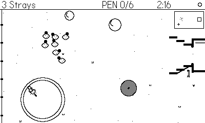

# Flock

*A sheepdog trial for Playdate.* You are the dog. Gather the flock, drive it
through the gate, don't lose your head when the geese turn on you.

## Playing

- **Crank** — steer the dog (1:1). With the crank docked, d-pad **left/right** steer.
- **Up / Down** — run / brake (neutral is a trot).
- **B (hold)** — creep: a slow stalk that keeps pressure on without spooking.
  How much pressure survives the creep is the dog's "eye" stat.
- **A** — bark: a burst of menace. Wayward animals snap back toward the
  flock, stubborn goats and belligerent geese behave for a few seconds —
  but everyone's panic rises. Overdo it and scatter-breeds explode.

Pen the required number of animals before the clock runs out. Clearing a
trial unlocks the next; early fields fit one screen, later ones scroll
(watch the minimap). Score = animals penned x 100 + time bonus.

### The dogs

| Dog | Breed | Feel |
| --- | --- | --- |
| Gwen | Border Collie | Balanced; her creep keeps full pressure (strong eye) |
| Bramble | Bearded Collie | Huge bark radius, quick recovery; weak eye |
| Pip | Corgi | Nimble turns, tiny presence — get close; animals stay calm around her |
| Flint | Kelpie | Fastest dog; everything he does agitates the flock |

### The animals (boids with breed parameters)

- **Sheep** — Merino (tight, easy mobs) / Blackface (loose, constant stragglers)
- **Goats** — Boer (stubborn: shrug off quiet pressure until barked at) /
  Alpine (fast, drawn to rocks)
- **Ducks** — Runner (strong alignment: they flow in lines) / Mallard
  (slow, panicky, always heading for a pond)
- **Geese** — Greylag (follow their leader — move the leader, win) /
  Canada (turn and charge the dog; bark first or get pecked)

Panicked "clump" breeds huddle; panicked "scatter" breeds explode. All
animal noises are synth facsimiles (wobbled-saw bleats, square quacks,
two-tone honks).

## Development

- `make` — release build to `out/Flock.pdx`
- `make smoke SEED=n` — instrumented build (autopilot + heartbeat datastore)
- `tools/smoke.sh [seconds] [until-grep] [seed]` — headless Simulator run;
  the bot outruns, flanks, drives, barks stragglers back, and once lets a
  level time out to exercise the fail path.

Pure Lua, no image assets — every animal and dog is drawn parametrically.
